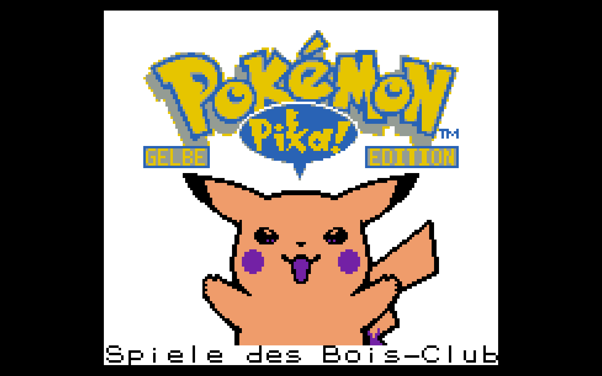
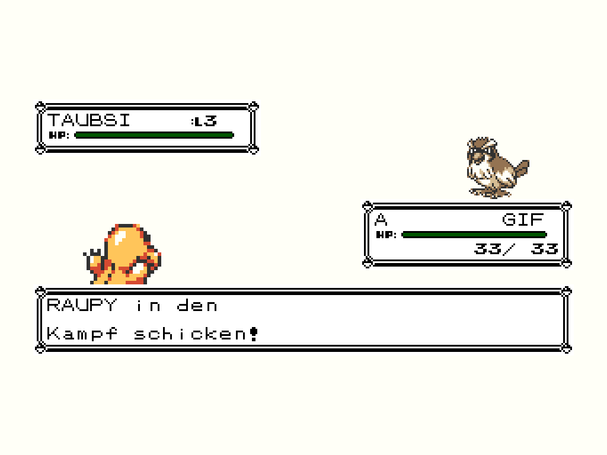
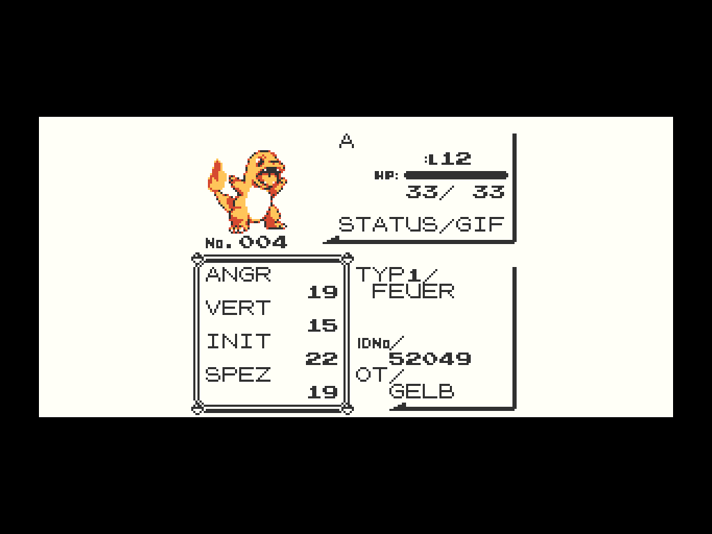

# Deutsch für Pokémon Gelb

Diese Mod macht die kanonische US-ROM in Gen1Recomp auf Deutsch spielbar.
Aktuelle Version: **1.0.2**.

Die Inhalte wurden nicht maschinell übersetzt: Dialoge, Pokédex-Texte, Namen,
Schriftzeichen und die Titelgrafik stammen aus der deutschen ROM von
**Pokémon Gelbe Edition – Special Pikachu Edition**. Die sehr klein gesetzte
Editionszeile wurde für Gen1Recomp eindeutig lesbar neu gezeichnet. Nur
zusätzliche Gen1Recomp-Oberflächen, die
im Game-Boy-Original nicht existieren, wurden separat übersetzt.

## Status

- 2.695 originale deutsche Dialog- und Pokédextexte einschließlich aller
  Gelb-spezifischen Szenen
- originale deutsche Pokémon-, Attacken-, Item-, Trainer- und Typnamen
- originale Schrift mit Ä, Ö, Ü, ä, ö, ü und ß
- deutsche Titelgrafik mit klar lesbarem „GELBE EDITION“
- deutsche Menüs sowie übersetzte Gen1Recomp-Zusatzoberflächen
- deutsche Kampftexte einschließlich Trainerwechsel und Gegnerbezeichnung
- deutsche Status- und Wertekürzel wie GIF, ANGR, VERT, INIT und SPEZ
- alle 151 Pokémon und 165 Attacken

## Bilder

## Installation

1. Unter **Releases** die Datei `deutsch-gelb-1.0.2.zip` herunterladen.
2. In Gen1Recomp **MODS > Import mod .zip** öffnen.
3. Das Archiv auswählen, die Mod aktivieren und das Spiel neu starten.

Die Mod wird ausschließlich beim Start von Pokémon Gelb aktiv; Rot und Blau
bleiben unberührt. Für das Spiel wird weiterhin eine eigene, rechtmäßig
erworbene US-ROM von Pokémon Gelb benötigt.

Die deutsche ROM wurde nur zur Erstellung ausgelesen; keine ROM wird
mitgeliefert oder verändert.

## Kompatibilität

Getestet mit Gen1Recomp Mod API 2. Die Mod verändert keine Spielstände und
übersetzt nur Darstellung und Inhalte.

## Hinweis

Inoffizielles Fanprojekt ohne Verbindung zu Nintendo, Game Freak oder
Creatures. Pokémon und zugehörige Namen, Grafiken und Texte sind Eigentum der
jeweiligen Rechteinhaber. Dieses Repository enthält keine ROM.
